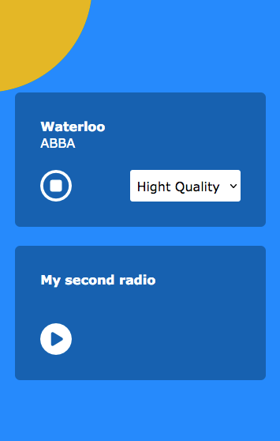
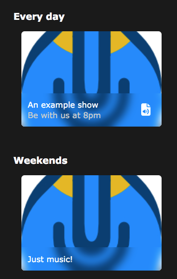
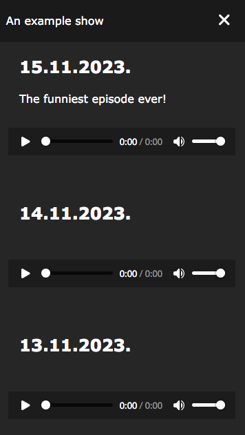
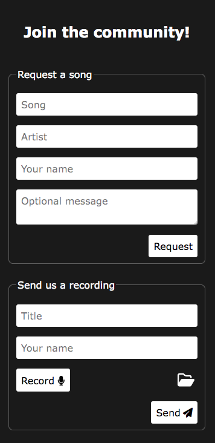
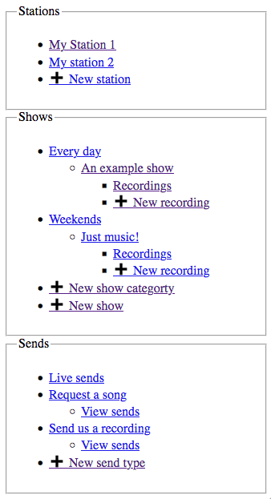
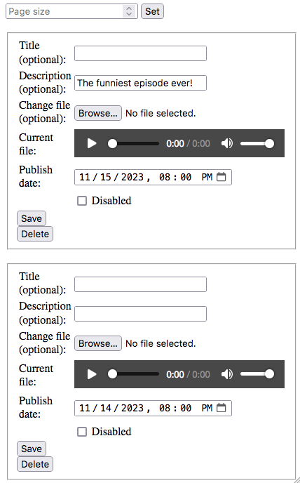
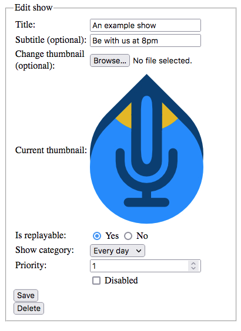

# WetRadio

Quickly setup a beautiful radio station website. [Installation guide](#installation)

### Radio player with live metadata and multi-stream support

Add as many stations as you want, now playing metadata will be automaticly fetched from the stream. If you have multiple streams of **different quality** you can allow your listeners to **choose the optimal one**, or if you have multiple streams of the same quality, but you want to **load balance** between them, you can also do that.
Powered by [icecast-metadata-player](https://github.com/eshaz/icecast-metadata-js/tree/master/src/icecast-metadata-player#readme)



#### Supported codecs:
| Codec                            | Playback method   |                   |               |
| -------------------------------- | ----------------- | ----------------- | ------------- |
|                                  | MediaSource       | HTML5 Audio       | Web Audio     |
| -------------------------------- | ----------------- | ----------------- | ------------- |
| audio/mpeg                       | probably          | maybe             | probably      |
| audio/aac                        | probably          | maybe             | not supported |
| audio/aacp                       | probably          | maybe             | not supported |
| audio/flac                       | probably          | maybe             | probably      |
| audio/mpeg; codecs="mpeg"        | probably          | maybe             | probably      |
| audio/mp4; codecs="mp3"          | probably          | not supported     | not supported |
| audio/mp4; codecs="mp4a.40.2"    | probably          | not supported     | not supported |
| audio/mp4; codecs="flac"         | probably          | not supported     | not supported |
| audio/mp4; codecs="opus"         | probably          | not supported     | not supported |
| audio/webm; codecs="vorbis"      | probably          | probably          | not supported |
| audio/webm; codecs="opus"        | probably          | probably          | not supported |
| application/ogg                  | maybe             | maybe             | maybe         |
| application/ogg; codecs="flac"   | probably          | probably          | probably      |
| application/ogg; codecs="opus"   | probably          | probably          | probably      |
| application/ogg; codecs="vorbis" | probably          | probably          | probably      |

Playback method will be automaticly selected depending on browser compatibility.
- MediaSource
  - Uses one request to read metadata and play audio. MediaSource compatibility is extended to include MPEG, AAC, and Ogg formats by using [mse-audio-wrapper](https://github.com/eshaz/mse-audio-wrapper) 
- HTML5 Audio
  - Uses two requests, one for HTML5 audio, and another to read metadata.
- Web Audio
  - Plays the audio using the Web Audio API. Uses [wasm-audio-decoders](https://github.com/eshaz/wasm-audio-decoders) to decode the audio in a Web Worker.


### Shows

Every radio station has some for of shows or at least a schedule, that's why we included that as well. Shows are organised into categories (i.e. Every day, Weekends...) and you can also manage **show recordings**. You can set a **custom image** for every show.



### Show recordings

For every show you can choose to enable or disable recordings. When you enable them, your listeners will be able to click on the "recordings" button and listen to a recorded show. If you want, since every recording has a publish date, you can set it to the **future** and make the recording **avaible only after that date and time passes**. This is useful if you have a prerecording or a podcast that you want your listeners to have access to only after certain date and time.

> **Note**: Setting date and time of a recording to the future and allowing listeners to access it only after that time passes uses the servers time zone, so it might not work correctly if it's different than yours.



### Interact with your listeners using sends

Sends allow you to setup **forms** your **listeners can submit** in order to interact with you. They also support **audio files**, so listeners can send you recordings of there voice. There is a **built-in recorder** they can use or they can choose a **specific file**. The built-in recorder is powered by [Benz AMR Recorder](https://github.com/BenzLeung/benz-amr-recorder/blob/master/README-EN.md).

 

## Admin panel

Yes, there is also an admin panel to help you manage all of this, it might not be the most beautifly, but it works.






### Disabling content

You can disable almost everything you want. Here's a quick recap on what disabling actually does:
- **Station** -> Disabled station is not accessible by visitors, but it's still in the kept int the database.
- **Show** -> Disabled show is not accessible by visitors but all its data, including recordings is still kept
- **Show recordings** -> If you disable recordings for a specific show, old recordings will be kept and you'll still be able to upload new ones. Everything will behave as if they were enabled except visitors won't be able to access them.
- **Show category** -> Disabled show category is not accessible by visitors but all its data, including recordings of underlying shows is still kept
- **Send type** -> Dsiabled send type is not accessible by visitor but its data, including listener recordings, is still kept.

Basically when you disable something, it's data (including images, audio files...) **isn't deleted**, it just isn't accessible by the site visitors.

## Installation

### Docker

First clone the repo:
```shell
$ git clone https://github.com/WetRadio/WetRadio.git
```

Create a user for the admin panel:
```shell
$ htpasswd -c WetRadio/public_html/admin/.htpasswd my_username
```

Change the owner of the `public_html` directory so that web server can write to the database:
```shell
$ chown -R www-data:www-data WetRadio/public_html
```

Run the container:
```docker
$ docker run -d -p 80:80 -v /path_to_the_cloned_repository/public_html:/var/www/html --name wetradio php:8.2.12-apache
```

### Existing web server

First clone the repo:
```shell
$ git clone https://github.com/WetRadio/WetRadio.git
```

Create a user for the admin panel:
```shell
$ htpasswd -c WetRadio/public_html/admin/.htpasswd my_username
```

Copy the `public_html` directory to your web server's document root:
```shell
$ cp -r WetRadio/public_html my/document/root
```

> Enshure your web server supports `.htaccess` files, instead you will need to manually configure the web server for security of the database and to **disallow unauthorized access to the admin panel**.
